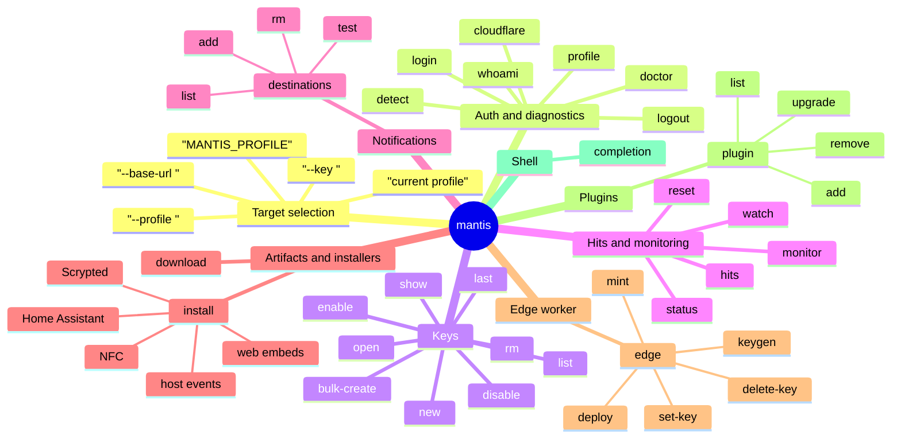
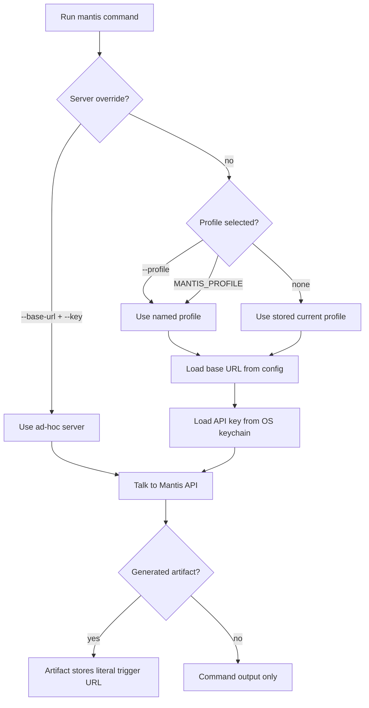
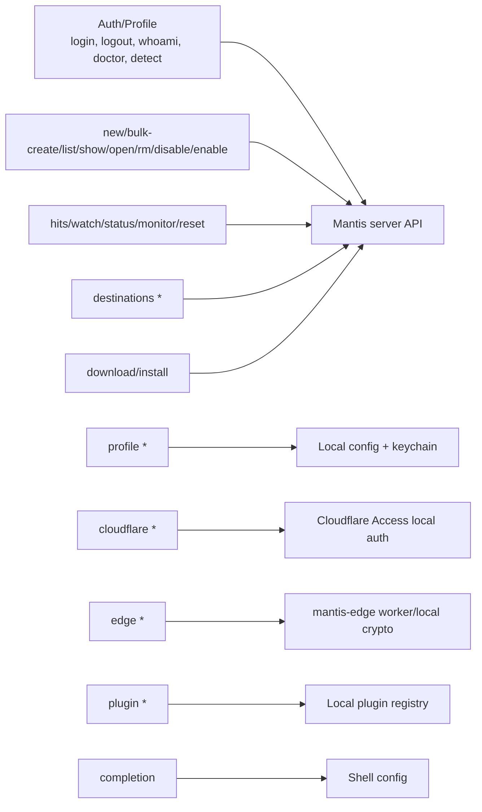
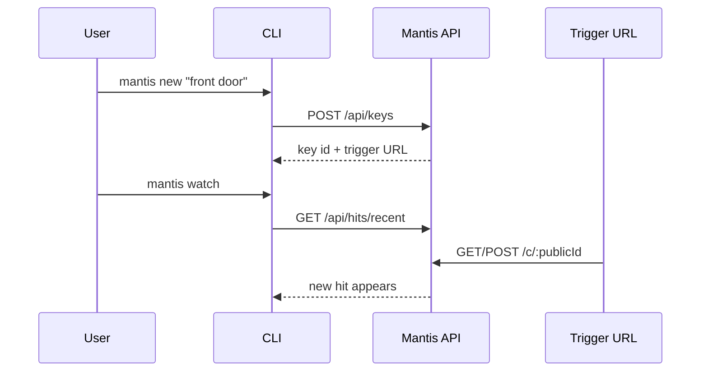
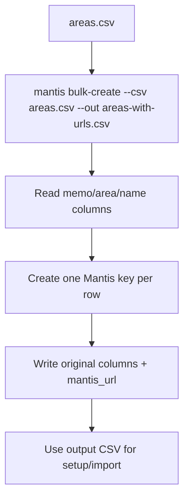
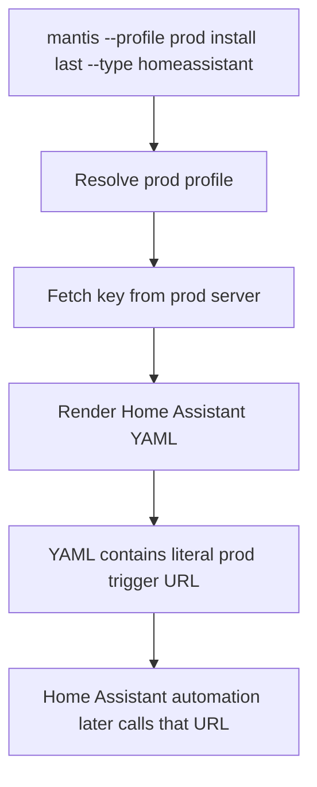
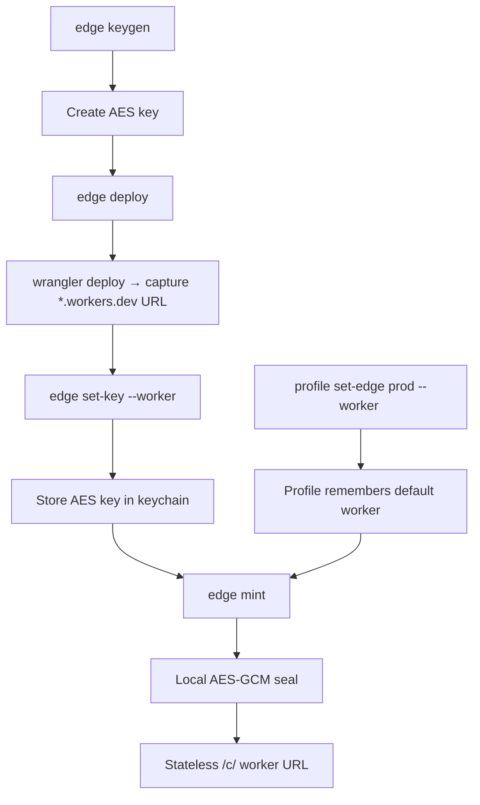
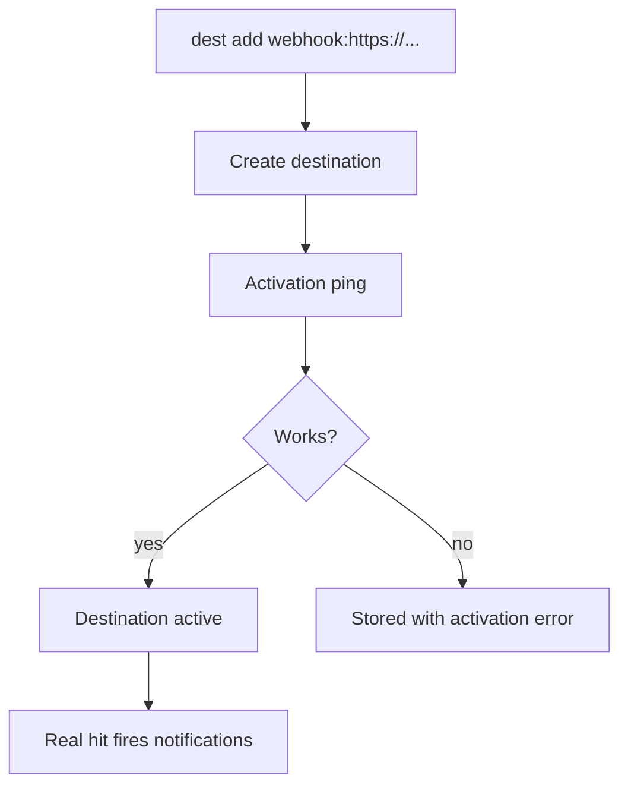
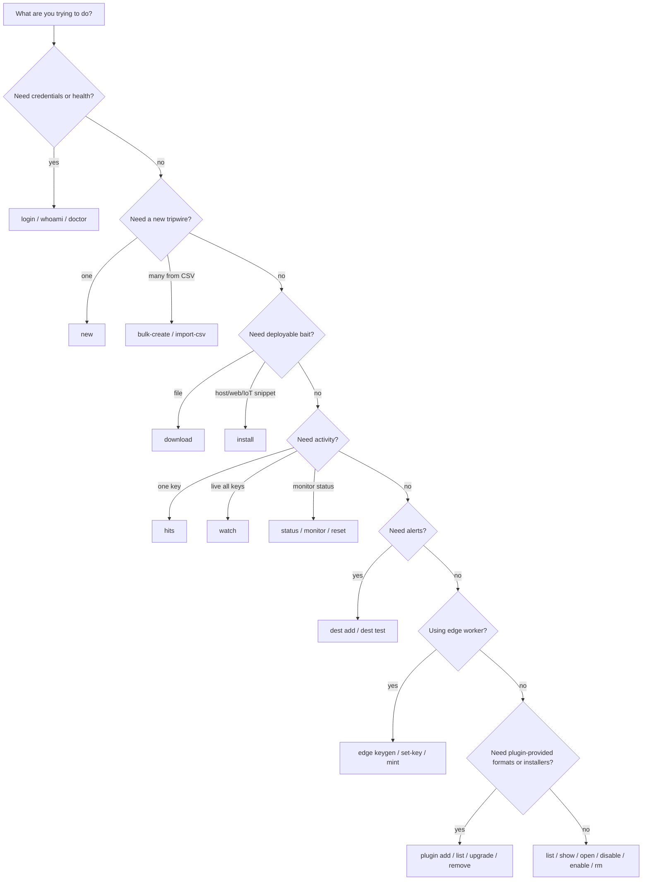

# Mantis CLI Command Map

This is a visual map of what `mantis` can do. It is meant as a navigation
document: start with the diagrams, then jump to the command tables when you
want exact command names and options.

## Mental Model

## How Commands Pick A Server

Profile selection happens when the CLI command runs. Generated files, Home
Assistant YAML, Scrypted scripts, NFC tag URLs, and host installers later ping
the literal URL embedded into them; they do not look up CLI profiles at runtime.

## Global Flags

These can be used with most commands:

| Flag | Purpose |
|---|---|
| `--base-url <url>` | Use a server URL just for this command |
| `--key <key>` | Use an API key just for this command |
| `-p, --profile <name>` | Use a named profile |
| `--json` | Emit JSON to stdout (NDJSON — one object per line — for `hits --follow` and `watch`) |
| `--output table\|json\|wide` | Choose human table, JSON, or wider table output |
| `-q, --quiet` | Suppress human-readable stdout |
| `--no-headers` | Hide table headers |
| `--color auto\|always\|never` | When to colorize output (env: `NO_COLOR`, `FORCE_COLOR`) |
| `--debug` | Print resolved target + stack + HTTP details on failure (env: `MANTIS_DEBUG`) |
| `--timeout <duration>` | Request timeout, e.g. `500ms`, `5s`, `1m` |
| `--retries <n>` | Retry transient GET failures, `0` to `5` |

## Command Families

## Full Command Catalog

| Family | Command | What It Does | Talks To |
|---|---|---|---|
| Auth | `init` | Guided first-time setup (server or edge), interactive | Server / local keychain / edge |
| Auth | `login` | Store API key for a profile, optionally creating/selecting it | Server + local keychain |
| Auth | `logout` | Clear stored credentials for current/all profiles | Local config/keychain |
| Auth | `whoami` | Show current profile, server, key prefix, Cloudflare state, edge worker | Local config |
| Auth | `doctor` | Check config, auth, server health, and split public/private hosts | Server + optional public URL |
| Auth | `detect` | Offline self-audit for Mantis-style installer artifacts on this machine | Local filesystem |
| Auth | `audit log` | List append-only audit events, most recent first (admin keys only) | Server |
| Profiles | `profile list` / `profile ls` | List profiles | Local config |
| Profiles | `profile current` | Print active profile name | Local config |
| Profiles | `profile use <name>` | Switch active profile | Local config |
| Profiles | `profile show [name]` | Show one profile | Local config |
| Profiles | `profile rm <name>` / `profile delete <name>` | Remove profile and keychain entry | Local config/keychain |
| Profiles | `profile set-edge <name>` | Link/unlink default edge worker URL for a profile | Local config |
| Cloudflare | `cloudflare login` | Cache Cloudflare Access SSO token via `cloudflared` | Cloudflare local tooling |
| Cloudflare | `cloudflare logout` | Clear cached Access credentials | Cloudflare local tooling |
| Cloudflare | `cloudflare set-service-auth` | Store Cloudflare Access Service Auth credentials | Local keychain |
| Cloudflare | `cloudflare status` | Show Cloudflare Access auth state | Local config/keychain |
| Keys | `new [memo]` | Create a key and optionally generate bait artifacts | Server |
| Keys | `bulk-create` / `import-csv` | Create many keys from a CSV and write an output CSV with generated URLs | Server |
| Keys | `list` / `ls` | List keys | Server |
| Keys | `show <id>` | Show one key | Server |
| Keys | `last` | Print most-recent key id | Server |
| Keys | `open [id]` | Open dashboard page or trigger URL in browser | Server for resolution |
| Keys | `disable <id...>` | Disable one or more keys without deleting history | Server |
| Keys | `enable <id...>` | Re-enable one or more disabled keys | Server |
| Keys | `rm <id...>` / `delete <id...>` | Delete one or more keys and cascade hits (`list --id-only \| xargs mantis rm -y`) | Server |
| Hits | `hits <id>` | Show/filter recent hits for one key | Server |
| Hits | `watch` | Live-tail recent hits across all keys or one key | Server |
| Monitoring | `monitor <id>` | Configure Uptime Kuma status behavior | Server |
| Monitoring | `reset <id>` | Reset latched monitor state | Server |
| Monitoring | `status [id]` | Show monitor state summary/detail | Server |
| Notifications | `destinations list <key-id>` / `dest list` | List destinations for a key | Server |
| Notifications | `destinations add <key-id>` / `dest add` | Add notification destination and activation test | Server |
| Notifications | `destinations rm <key-id> <destination-id>` / `dest rm` | Remove destination | Server |
| Notifications | `destinations test <key-id>` / `dest test` | Fire synthetic hit and show notification results | Server + trigger URL |
| Artifacts | `download <id>` | Download generated bait files for an existing key | Server |
| Artifacts | `install <id>` | Generate host/web/NFC/smart-home installer snippets | Server |
| Edge | `edge keygen` | Generate AES key for stateless edge worker | Local crypto |
| Edge | `edge deploy` | Deploy the worker (`wrangler deploy`) + capture its URL | Shells out to wrangler |
| Edge | `edge set-key` | Store edge AES key for worker URL | Local keychain |
| Edge | `edge delete-key` | Remove stored edge AES key | Local keychain |
| Edge | `edge mint` | Mint stateless Cloudflare Worker URL | Local crypto + keychain |
| Plugins | `plugin add <spec>` | Install a trusted local/GitHub CLI plugin | Local plugin registry |
| Plugins | `plugin list` / `plugin ls` | List installed plugins and provided installers/formats | Local plugin registry |
| Plugins | `plugin remove <name>` / `plugin rm` | Uninstall a plugin | Local plugin registry |
| Plugins | `plugin upgrade <name>` | Refresh a plugin from its source when not SHA-pinned | Local plugin registry |
| Shell | `completion <shell>` | Print shell completion script | Local stdout |
| Config | `config list/get/set/unset/path` | Get/set machine-wide defaults (output, color) | Local config |

`<id>` values usually accept a full UUID, a unique prefix of at least four hex
characters, or `last`.

## Common Workflows

### Create And Watch A Key

### Bulk Create From A Spreadsheet

### Generate A Smart-Home Installer

### Edge Worker URL

## Command Details

### Auth And Diagnostics

| Command | Key Options |
|---|---|
| `login` | `--url <url>`, `--key-stdin`, `--no-switch` |
| `logout` | `--all` |
| `whoami` | none |
| `doctor` | `--public-url <url>` |
| `detect` | `--scope user\|system\|all`, `--verbose`, `--deep` |
| `audit log` | `-n, --limit <n>` (1-500, default 100), `--since <duration-or-iso>`, `-t, --type <event_type>`, `--actor <api_key_id>` |

### Profiles

| Command | Key Options |
|---|---|
| `profile list` / `profile ls` | none |
| `profile current` | none |
| `profile use <name>` | none |
| `profile show [name]` | none |
| `profile rm <name>` / `profile delete <name>` | `--yes` |
| `profile set-edge <name>` | `--worker <url>`, `--clear` |

### Cloudflare Access

| Command | Key Options |
|---|---|
| `cloudflare login` | `--app <url>` |
| `cloudflare logout` | none |
| `cloudflare set-service-auth` | `--client-id <id>`, `--client-secret <secret>`, `--client-secret-stdin` |
| `cloudflare status` | none |

### Keys

| Command | Key Options |
|---|---|
| `new [memo]` | `--notify`, `--notify-webhook`, `--notify-email`, `--response-kind`, `--response-payload`, `--expires-at`, `--copy`, `--id-only`, `--url-only`, artifact flags |
| `bulk-create` / `import-csv` | `--csv`, `--out`, `--memo-column`, `--memo-template`, `--notify`, `--notify-webhook`, `--notify-email`, `--response-kind`, `--response-payload`, `--expires-at`, `--concurrency`, `--dry-run`, `--fail-fast` |
| `list` / `ls` | `--limit <n>`, `--all`, `--id-only`, `--url-only` |
| `show <id>` | `--copy`, `--qr-terminal`, `--id-only`, `--url-only` |
| `last` | none |
| `open [id]` | `--dashboard`, `--trigger` |
| `disable <id...>` | none (accepts multiple ids) |
| `enable <id...>` | none (accepts multiple ids) |
| `rm <id...>` / `delete <id...>` | `--yes` (accepts multiple ids; refuses on a non-TTY without `--yes`) |

Artifact flags available on `new`:

| Format | Flag |
|---|---|
| QR PNG | `--qr <file>` |
| Word | `--docx <file>` |
| Excel | `--xlsx <file>` |
| PowerPoint | `--pptx <file>` |
| PDF | `--pdf <file>` |
| Honey-directory zip | `--folder <file>` |
| SVG | `--svg <file>` |
| HTML | `--html <file>` |
| Markdown | `--md <file>` |
| Email | `--eml <file>` |
| Calendar | `--ics <file>` |
| Contact card | `--vcf <file>` |

### Downloads And Installers

| Command | Key Options |
|---|---|
| `download <id>` | `--docx`, `--xlsx`, `--pptx`, `--pdf`, `--folder`, `--nfc-label`, `--apple-wallet`, `--svg`, `--html`, `--md`, `--eml`, `--ics`, `--vcf` |
| `install <id>` | `--type <type>`, `--out <file>`, `--hostname <host>` for JS clone detector |

Installer types:

| Type | Category | Fires When |
|---|---|---|
| `shell` | Host | Shell starts; useful for SSH login detection |
| `shell-sudo` | Host | Wrapped `sudo` is invoked |
| `macos-login` | Host | macOS user logs in |
| `macos-boot` | Host | macOS boots |
| `macos-wake` | Host | macOS wakes |
| `macos-network` | Host | macOS network config changes |
| `linux-boot` | Host | Linux boots |
| `linux-wake` | Host | Linux resumes |
| `linux-network` | Host | NetworkManager interface comes up |
| `windows-logon` | Host | Windows user logon |
| `windows-wake` | Host | Windows resumes |
| `windows-network` | Host | Windows network profile connects |
| `css-background` | Web | CSS background image is rendered |
| `js-clone-detector` | Web | Page runs on unexpected hostname |
| `nfc-ndef` | Tag | NFC tag URL is opened |
| `homeassistant` | Smart home | HA automation calls generated rest_command |
| `scrypted` | Smart home | Scrypted Script sees selected device event |

### Hits And Monitoring

| Command | Key Options |
|---|---|
| `hits <id>` | `--limit <n>`, `--verbose`, `--since <duration-or-iso>`, `--ip <addr>`, `--bot-only`, `--follow`, `--interval <seconds>` |
| `watch [id]` | `--interval <seconds>` (positional `[id]` watches one key; `--id` is a deprecated alias) |
| `monitor <id>` | `--mode off\|latch\|window`, `--window <seconds>` |
| `reset <id>` | none |
| `status [id]` | `--limit <n>`, `--watch`, `--interval <seconds>`, `--tripped-only` |

### Notifications

| Command | Key Options |
|---|---|
| `destinations list <key-id>` / `dest list <key-id>` | none |
| `destinations add <key-id> [channel] [target]` / `dest add` | `--channel webhook\|email\|slack\|discord\|teams`, `--target <target>` |
| `destinations rm <key-id> <destination-id>` / `dest rm` | none |
| `destinations test <key-id>` / `dest test` | `--yes` |
| `destinations rotate-secret <key-id> <destination-id>` / `dest rotate-secret` | `--yes` (rotates a webhook destination's HMAC signing secret; new secret shown once) |

### Edge Worker

| Command | Key Options |
|---|---|
| `edge keygen` | none |
| `edge deploy` | `--dir <path>` (worker dir; defaults to `./` or `./mantis-edge`), `--set-key` (store the AES key locally after deploy), and any extra args after `--` forwarded to `wrangler deploy` |
| `edge set-key` | positional `[worker] [key]`, or `--worker <url>`; `--key-stdin` for CI (prompts for key if omitted) |
| `edge delete-key` | `--worker <url>` |
| `edge mint` | `--worker <url>`, `--webhook <url>`, `--channel webhook\|slack\|discord\|teams`, `--response-kind`, `--response-payload`, `--memo`, `--expires-at`, `--edge-key`, `--copy`, `--test`, `--install <type>` (with `--out`, `--ssh-only`, `--hostname`). Run bare on a TTY to launch the interactive wizard. |
| `edge install <url>` | `--type <type>`, `--out <file>`, `--ssh-only` (shell types), `--hostname <host>` (js-clone-detector), `--memo <text>`. Generates the same snippet `mantis install` produces server-side, but for a stateless edge URL. |
| `backup` | `--out <file>` (default `./mantis-backup.json`), `--only <name>`, `--passphrase-stdin`, `--passphrase-env <var>`. Exports all profiles (or one) + plugin manifest into a scrypt + AES-256-GCM encrypted JSON file. Safe to commit to a private git-crypt repo. |
| `restore <file>` | `--overwrite`, `--skip-plugins`, `--passphrase-stdin`, `--passphrase-env <var>`. Decrypts a backup bundle and writes profiles into config + keychain; re-installs plugins via `mantis plugin add <source>@<ref>`. Profiles that already exist are skipped unless `--overwrite`. |

Note: `mantis new` and `mantis install` mirror the edge surface:

- `mantis new` (no args) on a TTY launches the same wizard shape (memo → installer? → destinations loop → expiry → copy → summary/edit) and can chain `--install <type>` after key creation to template a host snippet in one shot.
- `mantis install` accepts `--ssh-only` for shell/shell-sudo types, matching `mantis edge install`.

The shared wizard primitives live in `src/lib/wizard.ts` (channel inference, channel-aware webhook prompt, summary + edit loop). Keep them in sync — both commands import from there.

### Shell Completion

| Command | Purpose |
|---|---|
| `completion bash` | Bash completion script |
| `completion zsh` | Zsh completion script |
| `completion fish` | Fish completion script |

### Plugins

| Command | Key Options |
|---|---|
| `plugin add <spec>` | GitHub spec `owner/repo[@ref]` or local path |
| `plugin list` / `plugin ls` | none |
| `plugin remove <name>` / `plugin rm` | none |
| `plugin upgrade <name>` | none |

## “Which Command Should I Use?”

